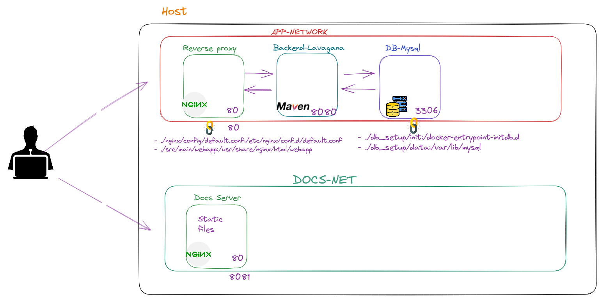

# Lavagna

This project is based on https://github.com/digitalfondue/lavagna, an open source project management tool.

## What I did

In this project, I built my own Docker files and connected the Lavagna application to a MySQL database. I also set up a reverse proxy using nginx, and served the application under the reverse proxy.

Additionally, I set up a documentation server running on port 8081, and the nginx server is running on port 80.

## Architecture



## How to run

To run this project, you will need to have Docker and Docker Compose installed on your machine.

Clone this repository to your local machine
```
git clone https://github.com/elior7557/Lavagna.git
```
Navigate to the root directory of the repository
```
cd Lavagna
```

Run docker-compose up to start the Lavagna application
```
docker compose up -d
```

    
## Access The Aplication
The application should now be running on your local machine.<br> You can access it by visiting http://localhost in your web browser. <br>
The documantion server is avalable on http://localhost:8081
